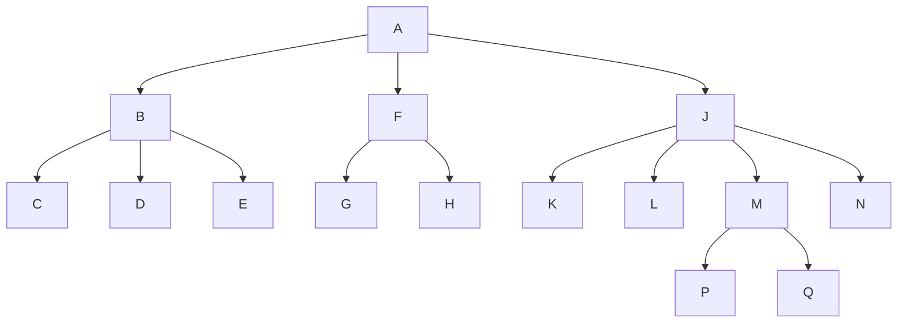
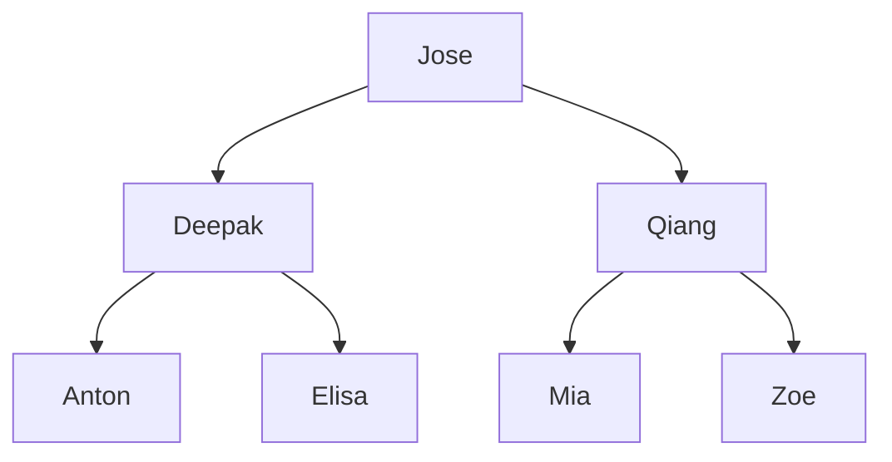

# Trees
- Lists, stacks, and queues are **linear**
  - Items are one after another
- Trees are **nonlinear, hierarchical**
  - Item can have more than one immediate successor
 
## Unrooted tree vs rooted tree

An unrooted tree is an acyclic graph (without cycle).
 
Label one node as the root ➡️ rooted tree.

## Terminology
- Parent, child, sibling, ancestor, descendant
- Root, leaf, internal node
- Subtree

## General Tree and Binary Tree
- General tree
  - No limit on the number of children
 

- Binary tree
  - at most two children
  - left child and right child

## Expression Tree
Binary trees that represent algebraic expressions

## Height of a Tree
- The number of nodes on the longest path from root to a leaf
- Maximum Height
  - The maximum possible height of a binary tree with n nodes is n

## Full Binary Trees
A full binary tree has all possible nodes at all levels

## Complete Binary Trees
A complete binary tree is full up to height h-1, with height h filled in from left to right.

## ADT Binary Tree
- Operations of ADT binary tree
  - Add, remove
  - Set, retrieve data
  - Test for empty
  - Traversal operations that visit every node

## Traversal of a Binary Tree
- Options for when to visit the root
  - Preorder: before it traverses both subtrees
  - Inorder: after it traverses left subtree, before it traverses right subtree
  - Postorder: after it traverses both subtrees
- Time complexity: O(n)

## Binary Search Tree (BST)
- A binary tree with the additional condition: The value in each tree node is
  - greater than all values in left subtree
  - less than all values in right subtree
