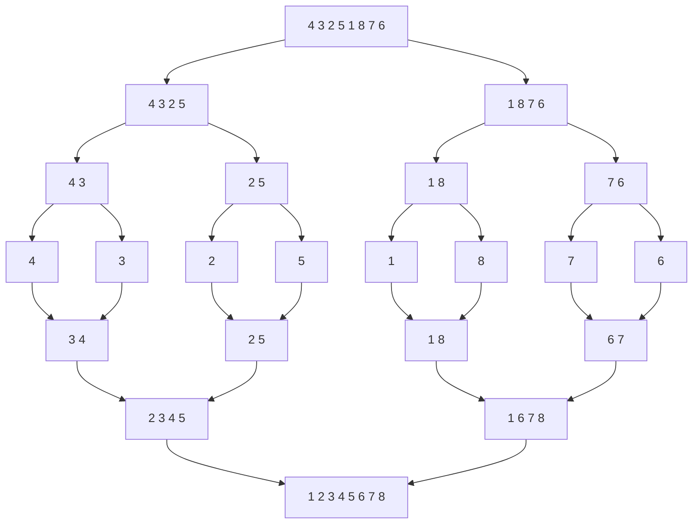

<h1 align="center"> Discrete Mathematics II - Homework #5 </h1>
<h2 align="center"> Justin Costenbader - jcost344@live.kutztown.edu </h2>
<h3 align="center"> November 21, 2023 </h3>

 
 

### 1. Use the definition of “ f(x) is O(g(x)) " to show that 2x + 17 is O(3x).

### 2. Show that (x2+1)/(x+1) is O(x).

### 3. Use a merge sort to sort 4, 3, 2, 5, 1, 8, 7, 6 into increasing order. Show all the steps used by the algorithm.

### 4. Re-do problem 3 with a quick sort.

Five levels of recursion are required:
   
1 2 3 (4) 5 8 7 6 ,
 
(1) 2 3 [4] (5) 8 7 6 ,
 
[1] (2) 3 [4] [5] 6 7 (8) ,
 
[1] [2] (3) [4] [5] (6) 7 [8] ,
 
[1] [2] [3] [4] [5] [6] (7) [8]

