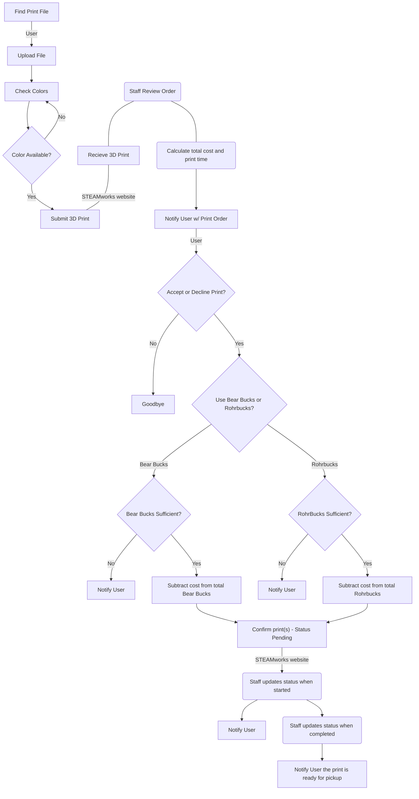

```mermaid
flowchart TD;
A[Find Print File] -- User --> B[Upload File]
    B --> C[Check Colors]
    C --> D{Color Available?}
    D -- Yes --> E[Submit 3D Print]
    D -- No --> C
    F[Recieve 3D Print] --- |STEAMworks website| E
    G(Staff Review Order) --- F
    G --- H(Calculate total cost and print time) --> I[Notify User w/ Print Order]
    I -- User --> J{Accept or Decline Print?}
    J -- No --> K[Goodbye]
    J -- Yes --> L{Use Bear Bucks or Rohrbucks?}
    L -- Bear Bucks --> M{Bear Bucks Sufficient?}
    L -- Rohrbucks --> N{RohrBucks Sufficient?}
    M -- No --> O[Notify User]
    M -- Yes --> P[Subtract cost from total Bear Bucks]
    N -- No --> Q[Notify User]
    N -- Yes --> R[Subtract cost from total Rohrbucks]
    P & R--> S["Confirm print(s) - Status Pending"]
    S --> |STEAMworks website| T(Staff updates status when started)
    T --> U[Notify User]
    T --> V(Staff updates status when completed)
    V --> W[Notify User the print is ready for pickup]
   
   
```
